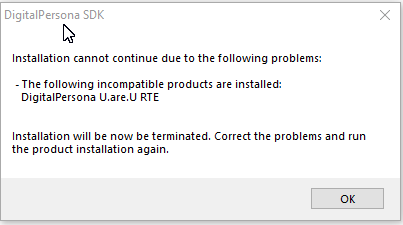

# Digital-Persona_U_ARE_U_4500_SCANNER
Biometric fingerprint scanner sample app for java swing desktop application and web based application

## TODO	
- [x] Put actual dependency for sl4j
- [x] Put actual dependency for mysql
- [x] Put actual dependency for xmlparcers
- [x] docuement installation steps
- [x] base64 string representation
- [x] fix database storage issue

## References

## common errors and FAQ

### How do i create image from base64 string

Goto https://codebeautify.org/base64-to-image-converter and enter your base64 string. Exampe is below.


### How do i get the connected digitalpersona device moddel and version number.

```
	ReaderCollection m_collection= UareUGlobal.GetReaderCollection();
  for (Iterator<Reader> iterator = m_collection.iterator(); iterator.hasNext();) {
            Reader next = iterator.next();
            Id description = next.GetDescription().id;
            System.out.println("Product_id:" + description.product_id);
            System.out.println("Product_name:" + description.product_name);
            System.out.println("vendor_id:" + description.vendor_id);
            System.out.println("vendor_name:" + description.vendor_name);
        }
```


### How to install local lib jar as maven artifact

	mvn install:install-file -Dfile=lib\bridj.jar -DgroupId=com.javax4u -DartifactId=bridj -Dversion=0.0 -Dpackaging=jar -DlocalRepositoryPath=maven_repository
	mvn install:install-file -Dfile=lib\dpjavapos.jar -DgroupId=com.javax4u -DartifactId=dpjavapos -Dversion=0.0 -Dpackaging=jar -DlocalRepositoryPath=maven_repository
	mvn install:install-file -Dfile=lib\dpuareu.jar -DgroupId=com.javax4u -DartifactId=dpuareu -Dversion=0.0 -Dpackaging=jar -DlocalRepositoryPath=maven_repository
	mvn install:install-file -Dfile=lib\javacpp.jar -DgroupId=com.javax4u -DartifactId=javacpp -Dversion=0.0 -Dpackaging=jar -DlocalRepositoryPath=maven_repository
	mvn install:install-file -Dfile=lib\javacv.jar -DgroupId=com.javax4u -DartifactId=javacv -Dversion=0.0 -Dpackaging=jar -DlocalRepositoryPath=maven_repository
	mvn install:install-file -Dfile=lib\javacv-windows-x86_64.jar -DgroupId=com.javax4u -DartifactId=javacv-windows-x86_64 -Dversion=0.0 -Dpackaging=jar -DlocalRepositoryPath=maven_repository
	mvn install:install-file -Dfile=lib\jmf.jar -DgroupId=com.javax4u -DartifactId=jmf -Dversion=0.0 -Dpackaging=jar -DlocalRepositoryPath=maven_repository
	mvn install:install-file -Dfile=lib\jpos113.jar -DgroupId=com.javax4u -DartifactId=jpos113 -Dversion=0.0 -Dpackaging=jar -DlocalRepositoryPath=maven_repository
	mvn install:install-file -Dfile=lib\jvideo.jar -DgroupId=com.javax4u -DartifactId=jvideo -Dversion=0.0 -Dpackaging=jar -DlocalRepositoryPath=maven_repository
	mvn install:install-file -Dfile=lib\mysql-connector-java.jar -DgroupId=com.javax4u -DartifactId=mysql-connector-java -Dversion=0.0 -Dpackaging=jar -DlocalRepositoryPath=maven_repository
	mvn install:install-file -Dfile=lib\slf4j-api.jar -DgroupId=com.javax4u -DartifactId=slf4j-api -Dversion=0.0 -Dpackaging=jar -DlocalRepositoryPath=maven_repository
	mvn install:install-file -Dfile=lib\webcam-capture.jar -DgroupId=com.javax4u -DartifactId=webcam-capture -Dversion=0.0 -Dpackaging=jar -DlocalRepositoryPath=maven_repository
	mvn install:install-file -Dfile=lib\xercesImpl.jar -DgroupId=com.javax4u -DartifactId=xercesImpl -Dversion=0.0 -Dpackaging=jar -DlocalRepositoryPath=maven_repository
	mvn install:install-file -Dfile=lib\xmlParserAPIs.jar -DgroupId=com.javax4u -DartifactId=xmlParserAPIs -Dversion=0.0 -Dpackaging=jar -DlocalRepositoryPath=maven_repository


### How to setup database connection

login as root

	mysql -u root -proot -h localhost
	create database testdatabase;
	CREATE USER 'test'@'%' IDENTIFIED BY 'test';
	SHOW GRANTS FOR 'test'@'localhost'; 
	GRANT ALL PRIVILEGES ON *.* TO 'test'@'%' ;
	SHOW GRANTS FOR 'test'@'localhost'; 
	use testdatabase;
	CREATE TABLE users (
	  userID varchar(32) NOT NULL,
	  print1 LONGBLOB,
	  PRIMARY KEY (userID),
	  INDEX	(userID)
	);
	exit
login as user test

	mysql -u test -ptest -h localhost
	use testdatabase;
	show tables;
	select * from users;

	
### Access denied for user 'test'@'localhost' to database 'testdb'

works only before mysql_8 version 

	GRANT ALL PRIVILEGES ON testdatabase.* TO 'test'@'%' IDENTIFIED BY 'test';
from mysql 8 onwards 

	GRANT ALL PRIVILEGES ON testdatabase.* TO 'test'@'%' ;

### Installation cannot continue due to the following problems:-The following incompatible products are installed:DigitalPersona U are U RTE



Solution: 


### what is the download link for SDK
	http://devportal.digitalpersona.com/fulfillment/download.php?id=132400
	
	Digitalpersona was acquired by crossmatch then hidglobal
	digitalpersona.com --> crosmmatch.com --> hidglobal.com

# scanner video should be shown to user

	https://www.youtube.com/watch?v=3U4G3XLT7VQ

## Future scopes of improvement
	
Add content section on top

driver download link should have 2 -3 options

downloaded directory should be explained in video

images of before installing driver and after installing driver should be compared in front of user

make one github link for windows installer msi guide


	

